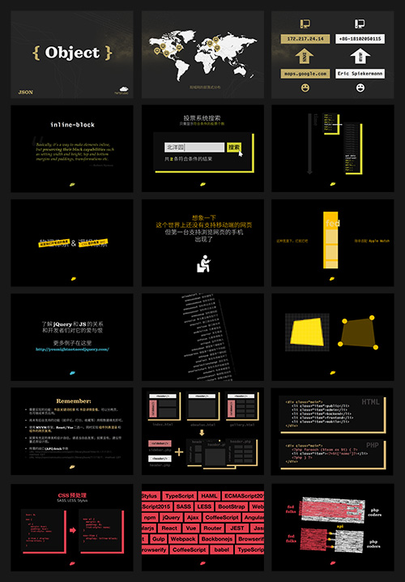

# fed-teaching-slides

此仓库内包含了天津大学[天外天工作室](https://coder.twtstudio.com/) Web 前端组新人培训的授课课程材料。您可以在 [Behance](https://www.behance.net/gallery/88357567/Fed-Teaching-Slides) 上预览教学内容。

This repo includes the teaching materials used in Tianjin University [TWT Studio](https://coder.twtstudio.com/) freshman courses. See preview at [Behance](https://www.behance.net/gallery/88357567/Fed-Teaching-Slides).

## Category 目录

- Week 1 - Getting Started 初探
- Week 2 - Diggin' Deeper into Layout 布局进阶
- Week 3 - Go Interactive 开发可交互的页面
- Week 4 - Requests on Data 网络请求与数据渲染
- Week 5 - The MVVM Architecture 理解 MVVM 架构
- Elective Course: HTTP Protocal & Computer Networking Basics HTTP 协议与计算机网络初探
- Elective Course: The Front-End Eco 前端生态：演化与思考
- Elective Course: Vector in Webs 网页中的矢量图形
- ...

## Q&A 疑问与解答

\- How were these slides made?   
\- 它们是使用什么制作的？

\- Apple Keynote, PowerPoint 2016 & Adobe Illustrator.    
\- Keynote, PPT 2016 和 Adobe Illustrator。

\- Is the original format available?   
\- 原始格式文件可用吗？

\- Due to the compatibility and display consistency problems for PowerPoint slides, this repo only contains exported pdfs. The animations and course scripts for these slides, therefore, are not available. However, if you are a Tianjin University student, you're always welcomed to join TWT Studio or apply for a class audition.   
\- 考虑到 PowerPoint 版本和字体系统兼容问题可能导致显示效果不一致，本仓库只包含了授课幻灯片所导出的 pdf 文件。授课时的幻灯片动画因此无法被展示，备课稿也没有包含。但如果你是一名天津大学的学生，并对我们的课程感兴趣，可以选择加入天外天或预约课程旁听。

\- Who authored these courses?   
\- 这些课程的作者是谁？

\- The initial designer and lecturer of these slides are Cyphexl (Tzingtao Chow). Some of the courses involve co-authoring. After Fall 2019, these materials were passed down to the new generations of TWT studio to modify and use.   
\- 本仓库所包含课件的最初设计者和授课人是 Cyphexl (Tzingtao Chow)，部分课程由其它作者参与。2019 年秋季学期之后，这些授课材料被传递至天外天下一代成员来自由修改和讲授。

\- Who are they targeting at?   
\- 课程是为谁而设计的？

\- Those who are completely new to web development.   
\- 不需要任何 Web 开发基础的人。

## License 协议

This content of this repo is licensed under [CC-BY-SA 4.0](https://creativecommons.org/licenses/by-sa/4.0/) unless otherwise specified.

除非特别说明，本仓库内容通过 [CC-BY-SA 4.0](https://creativecommons.org/licenses/by-sa/4.0/) 协议授权。
